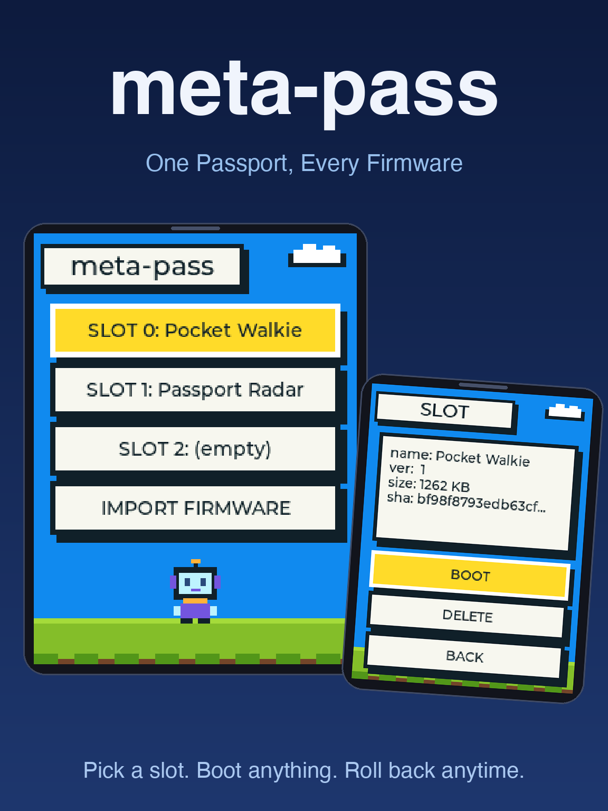
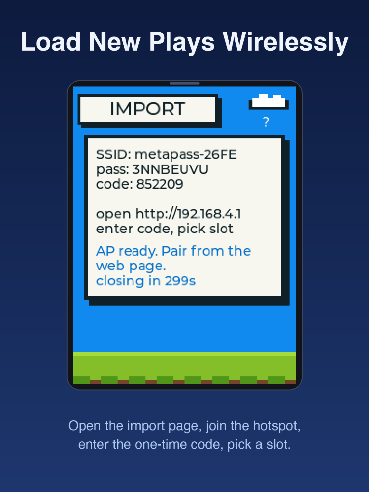

# meta-pass — turn the FoloToy AI Passport into a multi-firmware device

[简体中文](README.zh_CN.md) | English

meta-pass is a **multi-firmware launcher** for the FoloToy AI Passport (ESP32-C3,
8MB flash): flash meta-pass once, then install community firmware into three slots at
any time and boot them from a menu — **no more full reflashes**. Plays no longer
overwrite each other, and the launcher is always one power cycle away.

<p align="center">
  
</p>

[\](https://ai-passport.folotoy.cn/plays/281)

A stock Passport runs one firmware at a time; trying community plays means reflashing
the whole flash and back. meta-pass lives in the factory partition as a launcher and
turns the remaining flash into three OTA slots for child firmware:

```text
0x000000   bootloader
0x008000   partition table   nvs / phy_init (identical to stock)
0x010000   factory (1.44MB)  ← the meta-pass launcher itself
0x180000   ota_0 (1.84MB)    ← slot 0 (last 4KB = display-name blob)
0x356000   cardid (16KB)     ← device identity; untouched by every channel
0x360000   ota_1 (2MB)       ← slot 1 (last 4KB = display-name blob)
0x560000   ota_2 (2.61MB)    ← slot 2: bootable child slot OR littlefs recording storage
                               dual-use: boot checks for image, else mounts littlefs
0x7FE000   otadata           ← written by the launcher to pick a slot, then reboot
```

Selecting a slot = write otadata + reboot; the stock 2nd-stage bootloader does the
switch. No custom bootloader changes.

## Features

- **Three-slot switching**: each slot row shows firmware name/version/size/SHA-256;
  pick and boot. The display name is written at install time (community firmware all
  carry the template's default `project_name`, so the real name can only come from
  the install channel).
- **Dual-use slot 2**: when empty, slot 2 can be repurposed as littlefs storage (e.g.
  for a future recording firmware); the launcher detects the absence of a valid image
  and mounts the FS instead.
- **Two install channels**:
  - **USB serial install page** (recommended): open a local page in Chrome, hold UP
    while powering on to enter ROM download mode, write straight into a slot; accepts
    a local `.bin` (Full Flash images are unpacked in-page) or a plays marketplace
    link (auto-downloaded and verified against the store's published SHA-256);
  - **Device hotspot + web import**: the device starts a SoftAP and shows a pairing
    code; upload from a phone or computer browser.
- **Integrity checks**: magic, chip id, size and segment structure, with
  `esp_ota_end()` as the authoritative recheck; the SHA-256 is shown on the detail
  page for comparison with the store's value.
- **Unsigned-firmware warning**: booting unsigned firmware requires an extra-long OK
  press (LONG2). Malicious firmware would still get full flash access (no eFuse
  enforced signing) — only install firmware from sources you trust.
- **Never stuck in a child firmware**: un-adapted children are trial boots — any
  reboot (including power loss) returns to the launcher. Adapted firmware can
  persist and wires LONG2 to return to the launcher.
- **Identity safety**: the `cardid` partition is avoided by every install/flash path;
  `verify_firmware.py` byte-checks the baseline layout in the gate.

<p align="center">
  
  &nbsp;&nbsp;&nbsp;
  
  &nbsp;&nbsp;&nbsp;
  
</p>

## Quick start

### 1. Flash meta-pass (once)

Download `meta-pass_v0.2.2.bin` from Releases, or build it yourself (see
"Development"). Then:

```bash
python -m esptool --chip esp32c3 -p <port> -b 460800 \
    write-flash 0x0 meta-pass_v0.2.2.bin
```

The image ends at `0x780000` and never touches `cardid` (flashing tools only erase/write
the covered region; **never** run `erase-flash` on an identity-written device).

### 2. Install child firmware

**Option A: USB serial install page** (no hotspot needed):

Open **https://meta-pass.pages.dev/** in Chrome (hosted page + API proxy, zero
setup) — or run locally with `node tools/install-slot/server.mjs` →
http://localhost:4191/.

Hold UP while powering on → Connect in the page → pick a slot → choose a local file
or paste a plays link → Install → power-cycle. Full guide:
[install-slot/README.md](install-slot/README.md).

**Option B: device hotspot import** (no Chrome required):

Pick IMPORT FIRMWARE in the main list → the device starts a hotspot and shows a pairing
code → connect from a phone/computer, open `192.168.4.1` → enter the code, pick a
slot, upload a `.bin`.

### 3. Boot

UP/DOWN to pick a slot, OK for details, BOOT to confirm. Unsigned firmware asks for a
LONG2 (extra-long OK) confirmation.

## Button map

| Page | UP/DOWN | OK click | OK LONG (3 s) |
| --- | --- | --- | --- |
| Main list | select slot | open details / import page | — |
| Slot detail | BOOT/DELETE/BACK | confirm | DELETE needs LONG2 against accidents |
| Unsigned warning | — | cancel | confirm boot |
| Import page | — | — | exit import, back to list |

Inside an adapted child firmware: OK LONG = return to launcher (wired by the child,
see below).

## Adapting a child firmware (optional)

Children work unmodified (trial-boot mode). To persist across reboots and get LONG2
return, include `main/metapass_hook.h` and wire two calls:

1. Call `metapass_mark_valid()` after self-check (otherwise the next reboot returns to
   the launcher);
2. Route the OK key's LONG2 event to `metapass_return_to_launcher()`. Note the LONG
   event fires first at 1.5 s; give LONG a harmless in-app action (e.g. page back).

Signed badge (optional): `tools/signing/sign-firmware.sh <app.bin> [--egg-text "..."]`
appends an ECDSA-P256 badge (+ optional easter-egg text) after the image; meta-pass then
shows SIGNED on the detail page and boots without the warning page. The private key lives
in the macOS Keychain (created once via `tools/signing/bin/keychain-keygen`, which also
publishes `tools/signing/public.pem`); the signing key is held by the meta-pass
publisher — third-party developers submit binaries for signing rather than self-signing.

## Repository layout

| Path | Content |
| --- | --- |
| `main/` | Launcher UI (`main.c`), storage layer (`meta_store`), Wi-Fi import (`meta_net`), pure-logic modules (`meta_image`/`meta_slots`/`meta_import`/`meta_name`), child-firmware hook (`metapass_hook.h`) |
| `components/bsp/` | Board support package (stock + `BSP_BTN_LONG2` event) |
| `install-slot/` | USB serial install page, live at https://meta-pass.pages.dev/ (Cloudflare Pages: static assets + `_worker.js` API proxy) |
| `tools/install-slot/` | Local dev copy of the install page (`server.mjs` localhost server, zero dependencies) |
| `tools/validate.sh` | Unified gate: static checks + host tests + firmware build + protected-layout verification |
| `tests/` | Host tests (C, pure-logic modules, run on PC) |
| `docs/assets/meta-pass-design.md` | Design document (decision log and acceptance checklist) |

## Development

```bash
source <esp-idf-v5.5.3>/export.sh   # ESP-IDF v5.5.3 required
./tools/validate.sh --static        # repo checks + host tests
./tools/validate.sh --firmware      # firmware build + protected-layout verification
                                    # (isolated /tmp build, artifact copied back to
                                    #  build/meta-pass_v<version>.bin)
node tools/install-slot/test-extract.mjs   # installer unpacking / name-blob tests
```

Firmware changes are host-test-first (TDD); image parsing, slot metadata and checksums
are pure-logic modules with no ESP-IDF dependency.

## Verification record

| Category | Result (2026-09-13) |
| --- | --- |
| Build | Full `validate.sh` gate PASS; app 1,024,880 / 1,507,328 B (32% free); merged image 8 MB; `cardid` untouched |
| Host tests | `meta_image`/`meta_slots`/`meta_import`/`meta_name` suites all pass; installer node tests 7/7; **new** `test_meta_net_contract.py` pins JS↔C HTTP route consistency; **new** `test_meta_net_upload.c` (21 cases) drives the full pair→upload→flash→verify→blob flow with real SHA-256, stubbing ESP-IDF — zero hardware required |
| Simulator (passport-sim) | 3-slot list with real names via dynamic blob offsets (ota_0→0x355000, ota_1→0x55f000); navigation; detail metadata (`name: Pocket Walkie`, ver 1, 1262 KB, sha prefix); empty-slot BOOT no-op; unsigned warning page; LONG2 boot ota_0; hard-reset rollback to launcher; ota_1 Passport Radar boot + rollback; DELETE→LONG2 erase persists across reboot; IMPORT page (credentials/pair code/countdown); two observations judged non-firmware bugs (confirm-page residual rows = emulator canvas dirty-region artifact; import-page long-press exit needs longer hold = emulator timing model) |
| GitHub Actions | Static checks (Linux/GCC), firmware gate (ESPIDF Docker) — both green |
| CI artifact SHA-256 | `b86ca4fe…1b28e773` (canonical reference for marketplace publishing; local builds differ in embedded compile timestamp) |

## Relationship to the official firmware

This repository is based on
[FoloToy/ai-passport](https://github.com/FoloToy/ai-passport) (`f75873f`, MIT): the
`factory`/`cardid` layout, `verify_firmware.py` and other baseline contracts remain
byte-compatible; the stock demo pages were removed to make room for the launcher UI.
This is an unofficial project, not affiliated with FoloToy.

## FAQ

| Symptom | Fix |
| --- | --- |
| Serial picker is empty | Device is not in download mode (hold UP while powering on), or the USB cable is charge-only |
| Child firmware ignores buttons / no LONG2 return | Un-adapted firmware has no return hook; power-cycle to return (rollback). By design |
| Rebooting a child lands back in the launcher | Un-adapted children are trial boots; persist requires `metapass_mark_valid()` in the child |
| Slot shows "AI-Passport" instead of the play name | The firmware was installed without a display-name blob (merged image / old channel); reinstall via the USB page with a Display name |
| Image rejected | Over the slot's limit (`partition_size − 4KB`, the last 4KB sector is reserved for the name blob), or not an ESP32-C3 image |
