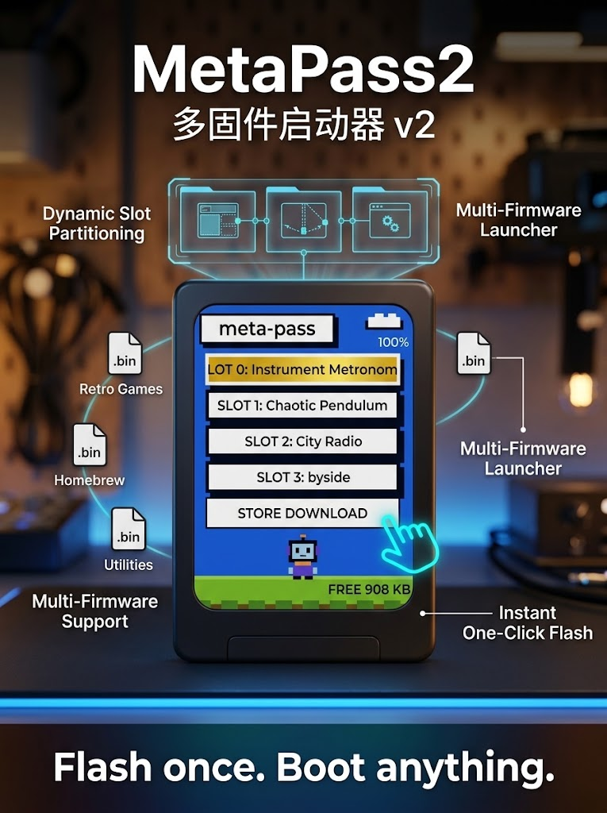
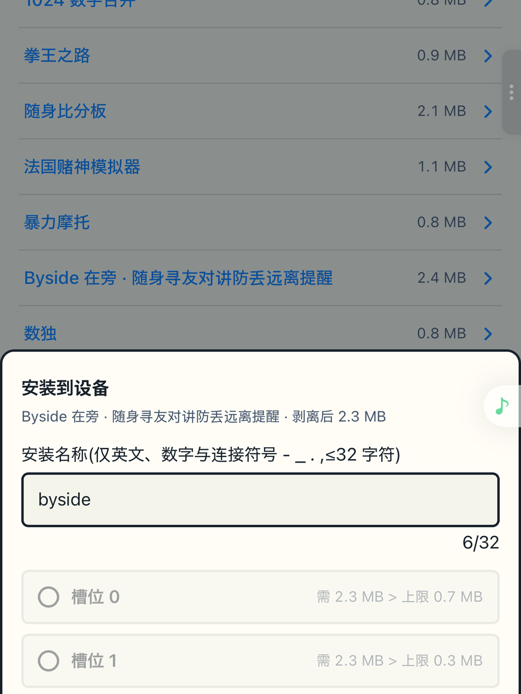
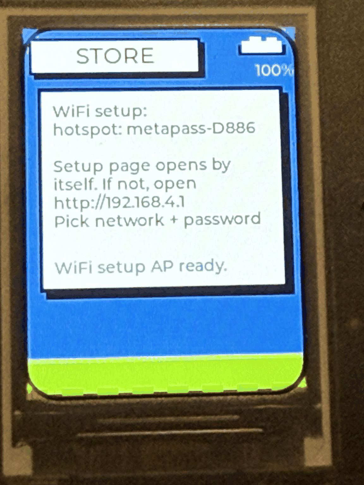
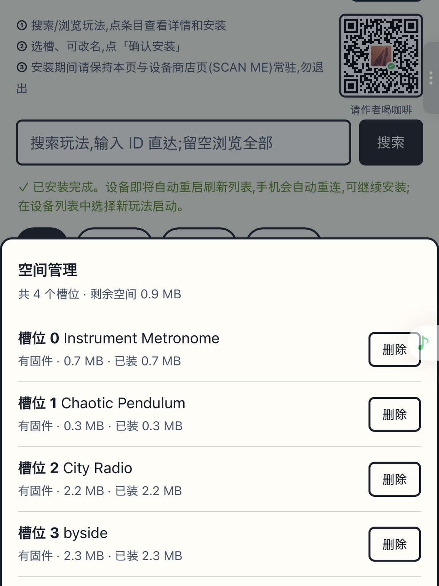

# meta-pass — turn the FoloToy AI Passport into a multi-firmware device

[简体中文](README.zh_CN.md) | English

meta-pass is a **multi-firmware launcher** for the FoloToy AI Passport (ESP32-C3,
8MB flash): flash meta-pass once, then install community firmware into three slots at
any time and boot them from a menu — **no more full reflashes**. Slot layout is dynamic on compatible devices: carve new slots from free space or remove unused ones, all from the USB installer. Plays no longer
overwrite each other, and the launcher is always one power cycle away.

<p align="center">
  
</p>

[\](https://ai-passport.folotoy.cn/plays/281)
>
>**v2.1.0 release notes**: [English](docs/release-notes/v2.1.0.md) · [简体中文](docs/release-notes/v2.1.0.zh_CN.md) — dynamic slot table, overwrite + delete, mock mode, phone retry across reboot window.

A stock Passport runs one firmware at a time; trying community plays means reflashing
the whole flash and back. meta-pass lives in the factory partition as a launcher and
turns the remaining flash into a dynamic slot pool for child firmware — carve slots on the fly or let the installer auto-allocate from free space:

```text
0x000000   bootloader
0x008000   partition table   nvs / phy_init (identical to stock)
0x010000   factory (1.44MB)  ← the meta-pass launcher itself
0x180000   slot pool         ← carved slots grow here; MPSC carve records at 0x35A000/0x35C000
0x356000   cardid (16KB)     ← device identity; untouched by every channel
0x360000   free space        ← new slots auto-allocated from here
0x7FE000   otadata           ← written by the launcher to pick a slot, then reboot
```

Selecting a slot = write otadata + reboot; the stock 2nd-stage bootloader does the
switch. No custom bootloader changes.

## Features

- **Three-slot switching**: each slot row shows firmware name/version/size/SHA-256;
  pick and boot. The display name is written at install time (community firmware all
  carry the template's default `project_name`, so the real name can only come from
  the install channel).
- **Dynamic slot management (dynslot)**: on devices with the dynamic partitioning
  feature, step 2 of the USB installer shows a live slot table instead of a static
  radio list — one row per carved slot (offset / size / state / name / max image),
  per-row **Remove** button, and an **Auto** row that proposes exact geometry for a
  new slot from free space. Installing into an occupied slot requires explicit
  confirmation; removing a slot erases its first 4 KB (anti-resurrection), commits
  the record, and re-materializes the partition table. Legacy 3-slot devices keep
  the old pre-checked default. All new strings are bilingual (EN / zh) and a
  language switch re-renders the table live. See
  [install-slot/README.md](install-slot/README.md).

- **Dual-use slot 2**: when empty, slot 2 can be repurposed as littlefs storage (e.g.
  for a future recording firmware); the launcher detects the absence of a valid image
  and mounts the FS instead.
- **Two install channels**:
  - **USB serial install page** (recommended for local files): open a local page in
    Chrome, hold UP while powering on to enter ROM download mode, write straight
    into a slot; accepts a local `.bin` (Full Flash images are unpacked in-page) or
    a plays marketplace link (auto-downloaded and verified against the store's
    published SHA-256);
  - **LAN phone-assisted install** (no computer/USB needed): pick STORE DOWNLOAD in
    the main list → the device either reuses saved WiFi credentials or starts a setup
    hotspot (`192.168.4.1`, random WPA2 password on screen) → once online the screen
    shows a QR code plus the device URL and a 6-digit pair code → scan it with a
    phone: the metapass web module runs market search, analyze, download and
    app-image extraction, then submits an install offer to the device; confirm the
    slot on the device (the physical OK unlocks the upload) and the phone streams
    the image over LAN HTTP while the device verifies length, SHA-256 and image
    structure. Analysis and unpacking never happen on-device.
- **Integrity checks**: magic, chip id, size and segment structure, with
  `esp_ota_end()` as the authoritative recheck; the SHA-256 is shown on the detail
  page for comparison with the store's value.
- **Unsigned-firmware warning**: booting unsigned firmware shows a warning page with
  BOOT / CANCEL buttons — UP/DOWN to choose, OK click to confirm (defaults to
  CANCEL). Malicious firmware would still get full flash access (no eFuse
  enforced signing) — only install firmware from sources you trust.
  reboot (including power loss) returns to the launcher. Adapted firmware can
  persist and wires OK LONG to return to the launcher.
- **Identity safety**: the `cardid` partition is avoided by every install/flash path;
  `verify_firmware.py` byte-checks the baseline layout in the gate.

<p align="center">
  
  &nbsp;&nbsp;&nbsp;
  
  &nbsp;&nbsp;&nbsp;
  
</p>

## Quick start

### 1. Flash meta-pass (once)

Download `meta-pass_v2.1.0.bin` from Releases, or build it yourself (see
"Development"). Then:

```bash
python -m esptool --chip esp32c3 -p <port> -b 460800 \
    write-flash 0x0 meta-pass_v2.1.0.bin
```

The image ends at `0x780000` and never touches `cardid` (flashing tools only erase/write
the covered region; **never** run `erase-flash` on an identity-written device).

### 2. Install child firmware

**Option A: USB serial install page** (no hotspot needed):

Open **https://metapass.chuanxilu.net/** in Chrome (hosted page + API proxy, zero
setup) — or run locally with `node tools/install-slot/server.mjs` →
http://localhost:4191/.

Hold UP while powering on → Connect in the page → pick a slot → choose a local file
or paste a plays link → Install → power-cycle. Full guide:
[install-slot/README.md](install-slot/README.md).

**Option B: LAN phone-assisted install** (no computer needed):

Pick STORE DOWNLOAD in the main list → WiFi setup hotspot (or auto-reconnect with
saved credentials; the setup page only collects WiFi name/password, no pairing
code) → once online the screen shows a QR code with the device URL and a 6-digit
pair code → scan it with a phone on the same WiFi (or open the shown URL and type
the pair code) → pick the play on the phone; it downloads, verifies and extracts
the app image, then submits an install offer → on the device, CONFIRM → pick a
target slot → the physical confirmation unlocks the upload → progress on both
screens → power-cycle to boot.

### 3. Boot

UP/DOWN to pick a slot, OK for details, BOOT to confirm. Unsigned firmware shows a
warning page: UP/DOWN to choose BOOT / CANCEL, OK click to confirm (defaults to CANCEL).

## Button map

| Page | UP/DOWN | OK click | OK LONG (1.5 s) |
| --- | --- | --- | --- |
| Main list | select slot | open details / store download | — |
| Slot detail | BOOT/DELETE/BACK | confirm | back to list |
| Unsigned warning | BOOT/CANCEL | confirm selection | cancel (back to detail) |
| Delete confirm | — | cancel | confirm delete |
| Store: WiFi setup | double-click UP = change WiFi | — | exit store, back to list |
| Store: QR (pair) | — | — | exit store, back to list |
| Store: offer info | CONFIRM/BACK | confirm selection (BACK = reject) | reject offer, back to QR |
| Store: pick slot | select slot | physical confirm — unlocks phone upload | back to offer info |
| Store: progress | — | back to QR after failure | open cancel confirm (while running); else — |
| Store: cancel confirm | CANCEL / BACK | execute selection | no cancel — keep waiting |
| Store: done | — | back to list | — |
| Store: any page (session-expired prompt) | — | continue current activity (extend) | exit store, back to list |

Cancel confirm (OK LONG while uploading; the upload keeps running in the
background): **CANCEL** = proceed with cancel, half-written slot invalidated;
**BACK** = no cancel, back to the progress page.

The store session timeout (default 5 min, auto-extended while an upload is running)
never closes the session by force: when it expires the screen shows
"Session timeout. OK = continue / LONG = exit store" and the user decides. The
timeout is configurable via `CONFIG_META_STORE_SESSION_TIMEOUT_MS` (menuconfig) or
at runtime with `meta_store_session_set_timeout_ms()` (clamped to 30 s – 24 h).

Inside an adapted child firmware: OK LONG = return to launcher (wired by the child,
see below).

## Adapting a child firmware (optional)

Children work unmodified (trial-boot mode). To persist across reboots and get OK LONG
return, include `main/metapass_hook.h` and wire two calls:

1. Call `metapass_mark_valid()` after self-check as an optional signature self-diagnostic
   (return value only — children are single-session: every power-on returns to the launcher
   list page, so OK LONG always works as the escape hatch);
2. Route the OK key's LONG (1.5 s) event to `metapass_return_to_launcher()`.

Signed badge (optional): `tools/signing/sign-firmware.sh <app.bin> [--egg-text "..."]`
appends an ECDSA-P256 badge (+ optional easter-egg text) after the image; meta-pass then
shows SIGNED on the detail page and boots without the warning page. Input may be a bare
app image **or the full merged image (bootloader + partition table + app — the
marketplace flashable format)**; merged inputs keep their header bytes byte-for-byte and
only the pad + 4 KB metadata sector are appended. The private key lives
in the macOS Keychain (created once via `tools/signing/bin/keychain-keygen`, which also
publishes `tools/signing/public.pem`); the signing key is held by the meta-pass
publisher — third-party developers submit binaries for signing rather than self-signing.

## Repository layout

| Path | Content |
| --- | --- |
| `main/` | Launcher UI (`main.c`), storage layer (`meta_store`), LAN install channel (`meta_store_net` WiFi/provisioning/httpd + `meta_store_install` local install HTTP/OTA + `meta_store_json` bounded JSON parser + `meta_install_model` install rules), pure-logic modules (`meta_image`/`meta_slots`/`meta_name`), child-firmware hook (`metapass_hook.h`) |
| `components/bsp/` | Board support package (stock + explicit `BSP_BTN_LONG` 1.5 s threshold) |
| `install-slot/` | USB serial install page, live at https://metapass.chuanxilu.net/ (Cloudflare Pages: static assets + `_worker.js` API proxy) |
| `tools/install-slot/` | `server.mjs` localhost server (serves the canonical `install-slot/` page directly — single source, zero dependencies) |
| `tools/validate.sh` | Unified gate: static checks + host tests + firmware build + protected-layout verification |
| `tools/build-firmware.sh` | One-command local firmware build for beginners (finds ESP-IDF, builds, merges, verifies, prints flashing guide) |
| `tests/` | Host tests (C, pure-logic modules, run on PC) |
| `docs/assets/meta-pass-design.md` | Design document (decision log and acceptance checklist) |

## Development

### Build the firmware locally (one command)

```bash
tools/build-firmware.sh
```

That's it. The script finds ESP-IDF v5.5.3 automatically (`~/esp/esp-idf-v5.5.3`,
or pass `--idf-path <dir>`), builds, merges the 8 MB full image, verifies the
protected layout **and upgrade safety** (the NVS / cardid / ota_0-2 / otadata
regions must stay erased in the artifact), and drops artifacts into `build/`.
The **only release artifact** is `meta-pass_v<version>.bin` (~1.1 MB): a hybrid
single file — bootable body (bootloader + partition table + phy + app) plus a
44-byte `MPUPV2` footer — that serves both the market install (flash tools
write it raw at 0x0) and the USB-installer launcher upgrade (the page verifies
the footer and slices the upgrade segments out of the body). If ESP-IDF is
missing it prints step-by-step install commands. First-time install of ESP-IDF:

```bash
mkdir -p ~/esp
git clone -b v5.5.3 --recursive https://github.com/espressif/esp-idf.git ~/esp/esp-idf-v5.5.3
~/esp/esp-idf-v5.5.3/install.sh esp32c3
```

### Upgrading the launcher without losing data

The partition layout is stable, so launcher upgrades never need to touch user
data. Two paths:

- **USB installer page (recommended)** — section "7. Upgrade launcher": pick
  the **same single file** `build/meta-pass_<version>.bin` that goes to the
  market. The page verifies the `MPUPV2` footer (integrity SHA-256), reads
  back the device partition table and byte-compares it (a layout mismatch
  refuses the upgrade), then writes bootloader / partition table / app from
  the file body and resets otadata to its erased state. NVS (stored data:
  Wi-Fi config, per-app state), `cardid`, and all three child-firmware slots
  stay untouched. Legacy `MPUPV1` upgrade containers (already distributed)
  remain accepted.
- **Command line** — equivalent esptool invocation (upgrade = four regions
  only; never flash the full merged image over an existing installation):

```bash
python -m esptool --port PORT write_flash 0x0 bootloader.bin 0x8000 partition-table.bin \
  0x10000 FoloToy-AI-Passport.bin 0x7fe000 ota_data_initial.bin
```

Never flash a release file raw at 0x0 over an existing installation to
"upgrade": esptool erases every sector it writes, and the file's ~1.1 MB
coverage includes the NVS region (carried as erased 0xFF), so Wi-Fi settings
and per-app stored data would be wiped. Child-firmware slots start at 0x180000,
beyond the file's coverage, and would survive — but upgrade through the
installer page above or the four-region command form instead. The 8 MB merged
image is a build/verification intermediate kept in `build/`, never distributed;
`tools/verify_firmware.py` enforces that it carries no content in any
user-data region.

### Full validation gates

```bash
./tools/validate.sh --static        # repo checks + host tests
./tools/validate.sh --firmware      # firmware build + protected-layout verification
                                    # (isolated /tmp build, artifact copied back to
                                    #  build/meta-pass_v<version>.bin)
node tools/install-slot/test-extract.mjs   # installer unpacking / name-blob tests
```

Firmware changes are host-test-first (TDD); image parsing, slot metadata and checksums
are pure-logic modules with no ESP-IDF dependency.

## Verification record

| Category | Result (2026-10-06) |
| --- | --- |
| Build | Full `validate.sh` gate PASS; app 1,024,880 / 1,507,328 B (32% free); merged image 8 MB; `cardid` untouched |
| Host tests | `meta_image`/`meta_slots`/`meta_name`/`meta_store_json`/`meta_install_model` suites all pass; installer node tests all pass; channel ESP-IDF modules (`meta_store_net`/`meta_store_install`) are syntax-checked against IDF 5.x-signature stubs (`-fsyntax-only`, zero hardware) — *the WAN store-download suites (`meta_store_api` etc.) were retired with the download channel in `feat/mota`* |
| Simulator (passport-sim) | 3-slot list with real names via dynamic blob offsets (ota_0→0x355000, ota_1→0x55f000); navigation; detail metadata (`name: Pocket Walkie`, ver 1, 1262 KB, sha prefix); empty-slot BOOT no-op; unsigned warning page; LONG2 boot ota_0; hard-reset rollback to launcher; ota_1 Passport Radar boot + rollback; DELETE→LONG2 erase persists across reboot; IMPORT page (credentials/pair code/countdown); two observations judged non-firmware bugs (confirm-page residual rows = emulator canvas dirty-region artifact; import-page long-press exit needs longer hold = emulator timing model) — *recorded 2026-09-13, before LONG2 removal and the BOOT/CANCEL boot menu; those two interactions need a re-run* |
| GitHub Actions | Static checks (Linux/GCC), firmware gate (ESPIDF Docker) — both green |
| CI artifact SHA-256 | `b86ca4fe…1b28e773` (canonical reference for marketplace publishing; local builds differ in embedded compile timestamp) |

## Relationship to the official firmware

This repository is based on
[FoloToy/ai-passport](https://github.com/FoloToy/ai-passport) (`f75873f`, MIT): the
`factory`/`cardid` layout, `verify_firmware.py` and other baseline contracts remain
byte-compatible; the stock demo pages were removed to make room for the launcher UI.
This is an unofficial project, not affiliated with FoloToy.

## FAQ

| Symptom | Fix |
| --- | --- |
| Serial picker is empty | Device is not in download mode (hold UP while powering on), or the USB cable is charge-only |
| Child firmware ignores buttons / no OK LONG return | Un-adapted firmware has no return hook; power-cycle to return (rollback). By design |
| Rebooting a child lands back in the launcher | By design (single-session model): every power-on returns to the launcher list page; crash recovery uses the same rollback |
| Slot shows "AI-Passport" instead of the play name | The firmware was installed without a display-name blob (merged image / old channel); reinstall via the USB page with a Display name |
| Image rejected | Over the slot's limit (`partition_size − 4KB`, the last 4KB sector is reserved for the name blob), or not an ESP32-C3 image |
